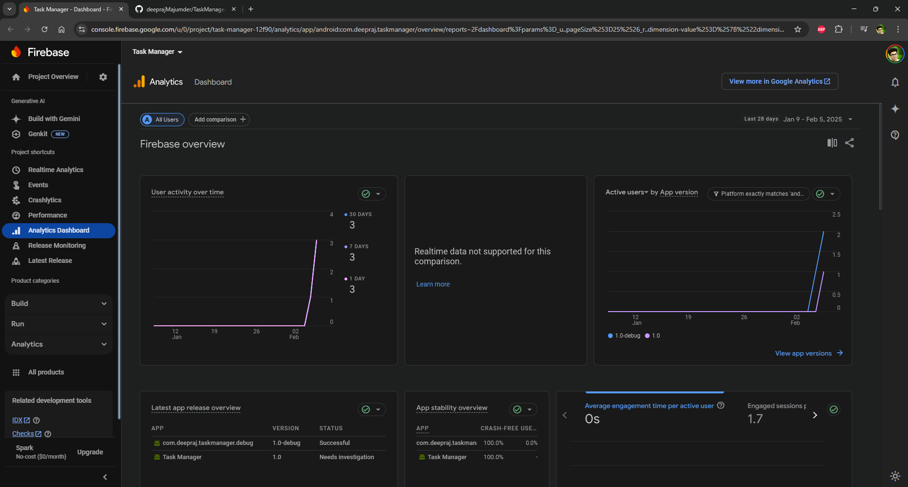
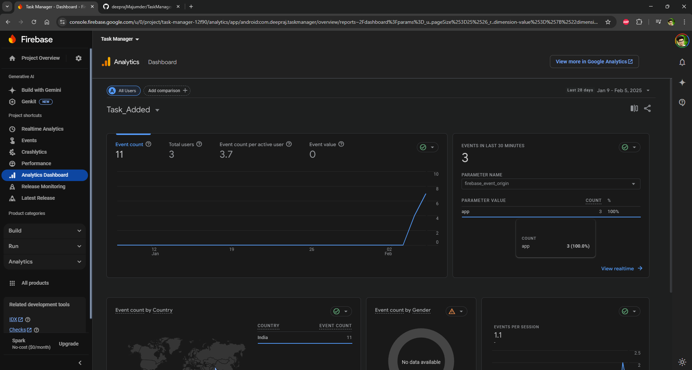
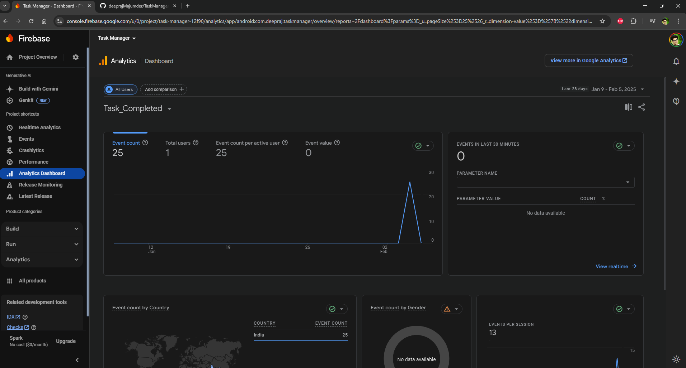
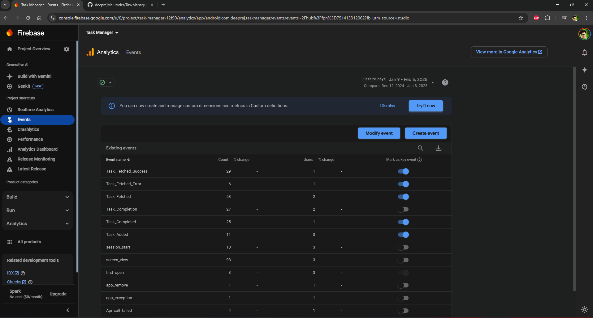
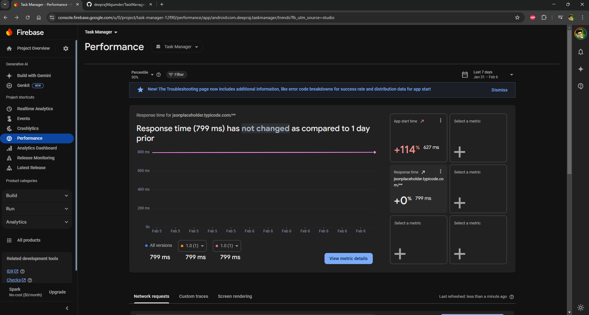
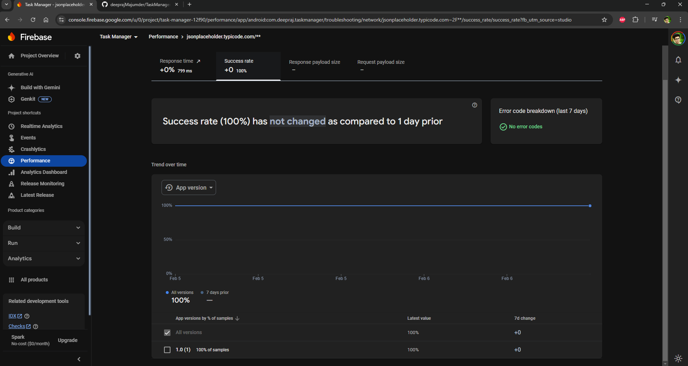
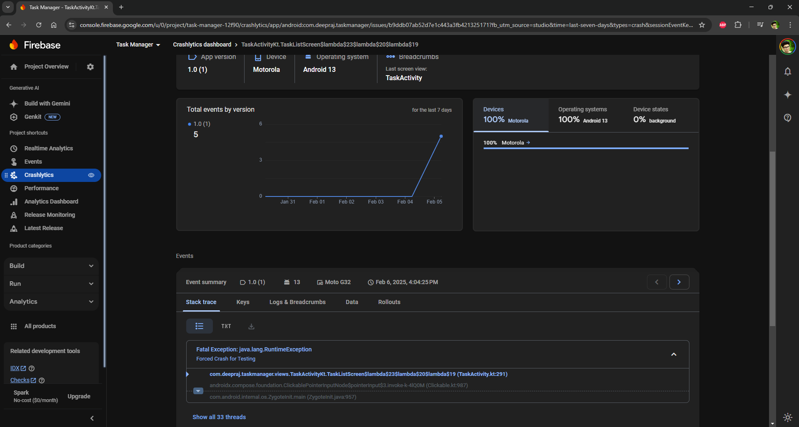
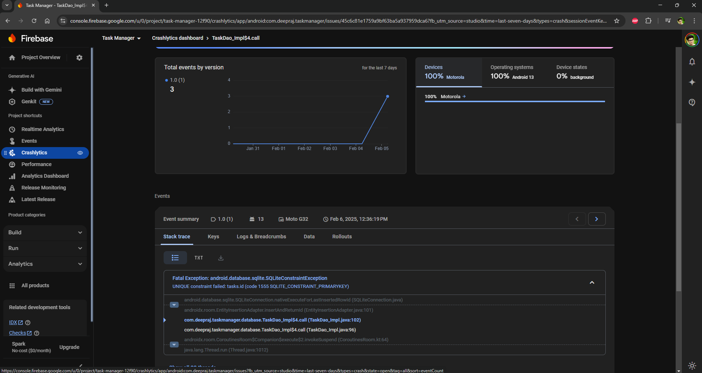

# 📱 Task Manager

A modern Android app built with **Kotlin** and **Jetpack Compose**, following clean architecture principles with **MVVM** and **Hilt Dependency Injection**. The app integrates **Room Database, Firebase Analytics, and Crashlytics** for a seamless user experience.

---

## 🚀 Features

- ✅ Jetpack Compose UI for a modern UI experience.
- ✅ MVVM architecture for better separation of concerns.
- ✅ Hilt for Dependency Injection.
- ✅ Room Database for local task storage.
- ✅ Retrofit for API call.
- ✅ API integration to fetch tasks from a remote server.
- ✅ Firebase Analytics & Crashlytics integration.

---

## 🛠️ Setup & Run Instructions

### Prerequisites

- 📌 Android Studio **latest version**
- 📌 JDK **17+**
- 📌 An **active Firebase project** (for Analytics & Crashlytics)
- 📌 Internet connection for API calls

### Steps

1. **Clone the repository**
   ```bash
   git clone https://github.com/deeprajMajumder/TaskManager
   cd TaskManager
   ```
2. **Open in Android Studio** and sync Gradle. Required AGP = 8.8.0
3. **Set up Firebase**:
   - Add your `google-services.json` file to the `app/` directory.
   - Enable Firebase Analytics & Crashlytics in the Firebase console.
4. Add **baseUrl="https://jsonplaceholder.typicode.com/"** in gradle.properties
5. Add **keystore.properties** for running release variant with parameters are below
   - storePassword=myStorePassword
   - keyPassword=mykeyPassword
   - keyAlias=myKeyAlias
   - storeFile=myStoreFileLocation
6. **Run the app** on an emulator or physical device.
7. **Check logs** for Firebase event tracking:
   ```bash
   adb shell setprop log.tag.FirebaseAnalytics DEBUG
   adb logcat -s FirebaseAnalytics
   ```

---

## 📦 Third-Party Libraries Used

| Library | Purpose |
|---------|---------|
| [Jetpack Compose](https://developer.android.com/jetpack/compose) | UI framework |
| [Hilt](https://dagger.dev/hilt/) | Dependency Injection |
| [Retrofit](https://square.github.io/retrofit/) | API calls |
| [Room](https://developer.android.com/jetpack/androidx/releases/room) | Local database |
| [Firebase Analytics](https://firebase.google.com/docs/analytics) | Event tracking |
| [Firebase Crashlytics](https://firebase.google.com/docs/crashlytics) | Crash reporting |

---

## 🏗️ Design Decisions

- **MVVM Architecture**: Keeps UI logic separate from business logic.
- **Hilt for Dependency Injection**: Ensures better code maintainability.
- **Singleton for Firebase Analytics**: Prevents multiple instances and ensures efficient logging.
- **Repository Pattern**: Ensures data sources are well-structured and easily testable.
- **Separation of Concerns**: Each class follows the Single Responsibility Principle.

---

## 📊 Firebase Analytics Events

Below are screenshots of key **Firebase Analytics** events:

🖼 Firebase Analytics Dashboard


🖼 Task Added


🖼 Task Completed


🖼 Events Dashboard


🖼 Network Performance


🖼 Network Call Success Rate


---

## 🔥 Crash Reports & Debugging

A recording of the app crashing and **Crashlytics logs**:

📹 **Screen recording of the crash**  

   - Forced Crash
     🎬   

     - Forced DataBase Crash
     🎬   

📸 **Firebase Console Crash Logs**  

   - Forced Crash 
   🖼 
   - Forced DataBase Crash
   🖼 
---

## 🌐 Network Performance

Below is an analysis of **network request performance**:

🖼 

---

## 📜 License

```
MIT License
© 2025 Deepraj Majumdar
```

---

💡 **Contributions are welcome!**

